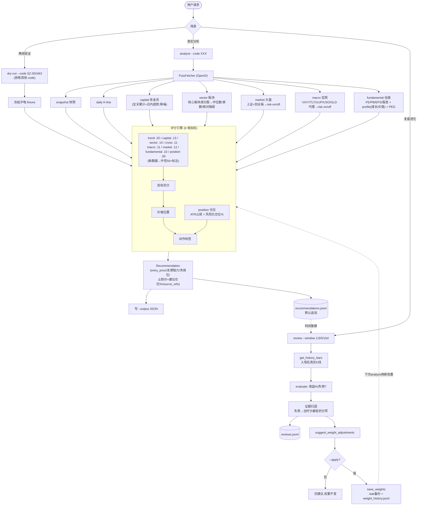

# Self-Evolving Stock Skills Usage

## Analyze a real instrument (live)

Fetch snapshot, daily K-line, capital flow, sector strength, market regime, macro proxies, and valuation through Futu OpenD and score the instrument by its own data:

```bash
python3 -m tools.stock_skills.cli analyze --code SZ.002463 --output /tmp/hudian-recommendation.json
```

Optional flags:

- `--bars N`: number of daily bars to fetch (default 30).
- `--cross US.QQQ US.NVDA`: cross-market reference codes to fetch for the cross-market score.
- `--indices SH.000001 SZ.399006`: market index codes for the market-regime score (default: 上证综指 + 创业板指).
- `--sector-limit N`: how many of the core plate's constituents to sample for sector strength (default 30).
- `--macro-codes US.VIXY US.TLT ...`: override the macro proxy ETFs (default: VIXY/TLT/UUP/USO/GLD).
- `--macro-json '{"fed_bias":"hike"}'`: hand-typed macro override (bypasses the proxy fetch).
- `--eps-growth 40`: YoY EPS growth % → enables PEG in the valuation score.
- `--revenue-growth / --gross-margin / --net-margin / --roe`: business-quality inputs (percent) → feed the fundamental quality sub-score.
- `--profile growth|value|neutral`: override the valuation profile (default inferred from watchlist tags).
- `--risk-budget-pct 1.0`: account % to risk per trade for position sizing (default 1.0).
- `--atr-multiple 2.0`: ATR multiple for the volatility stop (default 2.0).
- `--cost-basis 140`: existing cost basis, to report open P&L in the plan.
- `--no-sector` / `--no-market` / `--no-macro` / `--no-fundamental`: skip that fetch (the component scores neutral).
- `--last-trim-price 149.5`: prior partial-trim price for position context.
- `--weights path`: a `signal_weights.json` to use instead of the built-in weights.

The score combines eight components — trend, capital_flow, sector, cross_market, macro_risk, market_regime, fundamental, position_fit. **Trend is multi-timeframe**: on top of the 5-day breakout logic, an MA10/20/50 overlay sets a `trend_regime`; a breakout against a falling MA20<MA50 is demoted (false-breakout risk) and a trend-aligned breakout is rewarded (needs ≥~20 daily bars; below that the regime is `unknown` and the legacy logic is unchanged). Capital flow is denoised (full-day cumulative + intraday direction). Sector strength compares the instrument against its peer constituents; market regime reads the broad index trend; macro risk is derived from live proxy ETFs. The three backdrop factors (cross_market, macro_risk, market_regime) read the same risk-on/off tape, so the engine **de-duplicates** them via `backdrop_blend`: it blends them into one backdrop score and shrinks its deviation from neutral, so an agreeing tape counts ~once instead of three times (a neutral backdrop is unaffected, keeping label thresholds calibrated). **Valuation is profile-aware**: growth names (AI/semiconductor/PCB tags) tolerate a higher PE than value names, and a high PE is only "expensive" if growth (PEG, when `--eps-growth` is given) does not justify it; supplying `--revenue-growth/--gross-margin/--net-margin/--roe` adds a **business-quality** sub-score that can lift an otherwise-expensive multiple to "fair". **Position sizing is risk-based**: the stop is the tighter of the technical invalidation and an ATR volatility stop, and the suggested size spends `--risk-budget-pct` of the account over that stop distance — so a wider (more volatile) stop yields a smaller position and every trade risks roughly the same amount. The trader plan reports the concrete stop price and suggested size. Components without a data feed (cross_market without `--cross`, and any skipped fetch) score a neutral 50 and are flagged in `source_refs`. OpenD must be running for `analyze`.

Every new recommendation includes `data_quality`: available, missing, and stale components; session phase; evidence confidence; and whether the evidence is sufficient for a new entry. Missing data still leaves the directional component neutral for backward-compatible scoring, but it lowers evidence confidence and is never presented as observed neutrality.

By default `analyze` appends the recommendation to `data/journal/recommendations.jsonl` (the input for `review`). Pass `--no-journal` to skip, or `--journal path` to use a different file.

## Review and weight evolution

Replay past recommendations against the price action that followed, then optionally adjust the signal weights:

```bash
# Suggest only — writes reviews and prints proposed weights, but does NOT change weights:
python3 -m tools.stock_skills.cli review --window 3d

# Apply — writes the new weights back, with a backup and a history entry:
python3 -m tools.stock_skills.cli review --window 5d --apply
```

How it works:

1. Reads `data/journal/recommendations.jsonl` (filter with `--code`).
2. For each call with a timestamp and positive `entry_price`, fetches the following daily bars via OpenD and evaluates the 1/3/5/10-day outcome (`--window`).
3. Appends each outcome to `data/journal/reviews.jsonl`, including `dominant_failure` and `attribution_reason`. Failure attribution is evidence-based: a losing call is blamed on the component that gave the lowest score (the strongest warning that was overridden) at recommendation time.
4. Suggests weight changes from recurring failure factors.
5. With `--apply`, writes the new weights to `data/models/signal_weights.json`. The change is **reversible** (previous file saved to `signal_weights.json.bak`) and **explainable** (appended to `data/models/weight_history.jsonl` with old/new values and a reason). Without `--apply`, nothing is written back.

Weight changes require at least 60 realised review rows. `--apply` below that threshold records no weight change and creates no backup; this prevents the system from adapting to a handful of correlated outcomes.

## Backtest (offline win rate / expectancy / component edge)

Turn the review history into measured accuracy instead of an assumption. Reads the journals only — no OpenD (run `review` first so `reviews.jsonl` has outcomes):

```bash
python3 -m tools.stock_skills.cli backtest \
  --recommendations data/journal/recommendations.jsonl \
  --reviews data/journal/reviews.jsonl \
  --output /tmp/backtest.json
```

The report has two parts:

1. `summary`: `win_rate`, `wins`/`losses`, `invalidated`, `avg_return_pct`, `avg_win_pct`/`avg_loss_pct`, `payoff_ratio`, `expectancy_pct`, average `MFE`/`MAE`, and the same split `by_label` and `by_code`.
2. `component_edge`: for each of the eight factors, the win rate when that factor was bullish (score ≥55) vs bearish (≤45), and the `edge` (bullish minus bearish win rate). A positive edge is evidence the factor's weight is earned; a persistently negative edge flags a factor that is hurting more than helping and is a candidate for down-weighting (manually, or via `review --apply`).

This closes the loop the critique called out: trend/factor "accuracy" is now something you can measure on your own call history rather than take on faith.

## Analyze without OpenD (offline, from pre-fetched JSON)

When this process cannot reach OpenD (e.g. a sandbox), fetch on a machine that *can*
reach OpenD (the host), redirect the futuapi quote scripts' JSON into the mounted
workspace, then score it here — no OpenD, no network:

```bash
# On the host (OpenD running & logged in):
S=~/.codex/skills/futuapi/scripts/quote        # or wherever the futuapi skill lives
mkdir -p data/live
python3 $S/get_snapshot.py     US.SOXL --json            > data/live/SOXL.snap.json
python3 $S/get_kline.py        US.SOXL --ktype 1d --num 60 --json > data/live/SOXL.kline.json
python3 $S/get_capital_flow.py US.SOXL --json            > data/live/SOXL.cap.json   # optional

# Anywhere (no OpenD needed):
python3 -m tools.stock_skills.cli analyze-offline --code US.SOXL \
  --snapshot data/live/SOXL.snap.json --kline data/live/SOXL.kline.json \
  --capital data/live/SOXL.cap.json --output /tmp/soxl.json
```

`analyze-offline` scores trend (with the MA20/MA50 regime when ≥~20 bars are supplied),
capital flow, and position sizing fully; fundamentals are scored if passed via flags
(`--pe-ttm`, `--eps-growth`, `--revenue-growth`, …). The backdrop components
(sector/market/macro/cross) have no offline feed, so they score a neutral 50 and are
flagged in `source_refs`. A script error payload (e.g. "无法连接 OpenD") is surfaced as an
error rather than silently parsed.

## Backfill the journals from existing 复盘 notes

To give `backtest` data immediately — without waiting to accumulate live calls — import
the repo's hand-written review notes:

```bash
python3 -m tools.stock_skills.import_reviews            # writes data/journal/*.jsonl
python3 -m tools.stock_skills.import_reviews --dry-run  # preview, write nothing
python3 -m tools.stock_skills.cli backtest              # immediately usable
```

It parses each per-code note (`xiaopeng/`, `google/`, `600584/`, `002463/`, `002625/`,
`soxl-soxs/`, `circle/`, `MRVL/`) into a recommendation (code, date, entry price, a
keyword-heuristic label) and — because each code has several dated notes — **synthesises
review outcomes offline** by treating a later note's price as the realised future price
of an earlier call. So a win rate appears with no OpenD. Caveats are written into each
record's `source_refs`: entry prices and labels are best-effort parses, invalidation is
off by default (`--parse-invalidation` to enable), and self-review uses close-only
synthetic bars. Re-run the live `review` (with OpenD) for precise OHLC outcomes. Writes
are deduplicated by code+timestamp, so importing is idempotent.

## Dry Run (offline fixture)

Replay a frozen `SZ.002463` sample to verify the scoring pipeline without OpenD:

```bash
python3 -m tools.stock_skills.cli dry-run --code SZ.002463 --output /tmp/fixture-check.json
```

`dry-run` only accepts `SZ.002463`. It is a fixed fixture for pipeline checks, not analysis of the supplied code — use `analyze` for real instruments.

The output JSON contains:

- `label`
- `total_score`
- `component_scores`
- `analyst_hypothesis`
- `trader_plan`
- `support_levels`
- `resistance_levels`
- `invalidation_level`

## Live Data Path

Live data collection is routed through `tools.stock_skills.futu_fetcher.FutuFetcher`. `FutuFetcher` resolves `futuapi` in this order when `FUTUAPI_SKILL_DIR` is not set: `~/.codex/skills/futuapi`, `~/.agents/skills/futuapi`, then `~/.claude/skills/futuapi`. If none contains `scripts/quote/get_snapshot.py`, live analysis stops with an error listing every attempted location.

It fetches snapshot (`get_snapshot.py`), daily K-line (`get_kline.py`), capital flow (`get_capital_flow.py`), owner plates and plate constituents (`get_owner_plate.py` / `get_plate_stock.py`, for sector strength), index snapshots (for market regime), macro proxy ETF snapshots (VIXY/TLT/UUP/USO/GLD, for macro risk), valuation columns (PE-TTM/PB/EPS/dividend, via an inline SDK snippet the packaged scripts don't expose), and historical K-line for review (`get_kline.py --start/--end`), and stays quote-only — it never calls trade scripts. If a `futuapi` script returns an `{"error": ...}` payload, the fetcher raises it instead of pretending data is known. OpenD must be running for live calls. The analysis engine can still run on stored or fixture data when OpenD is unavailable.

## Analysis Flow



## Safety

This package produces analysis and review records only. It does not place real trades. Any real order must follow the existing `futuapi` explicit-confirmation flow.
