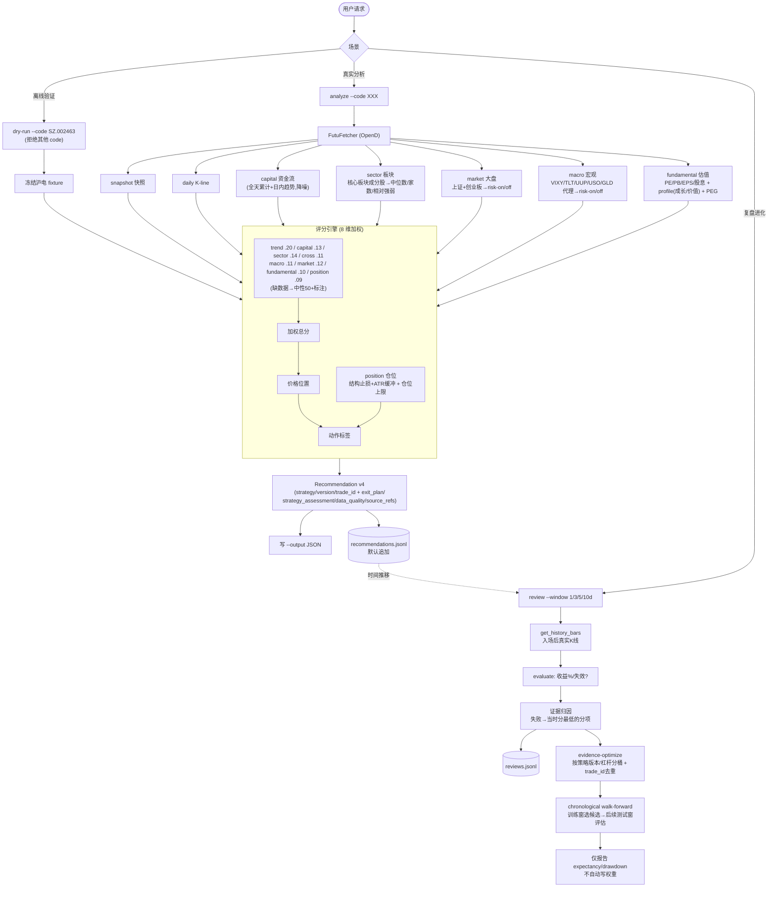

# Self-Evolving Stock Skills Usage

## Analyze a real instrument (live)

Fetch snapshot, daily K-line, capital flow, sector strength, market regime, macro proxies, and valuation through Futu OpenD and score the instrument by its own data:

```bash
python3 -m tools.stock_skills.cli analyze --code SZ.002463 --output /tmp/hudian-recommendation.json
```

Optional flags:

- `--horizon short|swing`: 1–3 day short profile or 1–4 week swing profile (default short).
- `--event-days N`: trading days until a known major event; required to clear the swing event gate.
- `--underlying-confirmed` / `--no-underlying-confirmed`: explicit underlying-proxy confirmation for leveraged ETFs.
- `--portfolio-open-risk-pct N` / `--theme-open-risk-pct N`: current risk heat; missing heat keeps a new setup at `watch`, exhausted heat rejects it, and partial headroom scales size down.
- `--bars N`: number of daily bars to fetch (default 30).
- `--cross US.QQQ US.NVDA`: cross-market reference codes to fetch for the cross-market score.
- `--indices SH.000001 SZ.399006`: market index codes for the market-regime score (default: 上证综指 + 创业板指).
- `--sector-limit N`: how many of the core plate's constituents to sample for sector strength (default 30).
- `--macro-codes US.VIXY US.TLT ...`: override the macro proxy ETFs (default: VIXY/TLT/UUP/USO/GLD/FXY/HYG/LQD).
- `--macro-json '{"fed_bias":"hike","jgb_stress":"elevated","yen_carry_stress":"elevated","credit_stress":"elevated"}'`: hand-typed macro override (bypasses the proxy fetch). Use the three stress fields only after checking raw JP10Y/JP30Y, USDJPY, MOVE, and credit/flow evidence.
- `--eps-growth 40`: YoY EPS growth % → enables PEG in the valuation score.
- `--revenue-growth / --gross-margin / --net-margin / --roe`: business-quality inputs (percent) → feed the fundamental quality sub-score.
- `--profile growth|value|neutral`: override the valuation profile (default inferred from watchlist tags).
- `--risk-budget-pct 1.0`: account % to risk per trade for position sizing (default 1.0).
- `--stop-buffer-atr 0.25`: ATR buffer beyond structural invalidation (default 0.25; `--atr-multiple` is retained as a compatibility alias).
- `--cost-basis 140 --trade-id original-trade-id`: existing-position context; the original trade id is mandatory so management records remain linked.
- `--no-sector` / `--no-market` / `--no-macro` / `--no-fundamental`: skip that fetch (the component scores neutral).
- `--last-trim-price 149.5`: prior partial-trim price for position context.
- `--weights path`: a `signal_weights.json` to use instead of the built-in weights.

The score combines eight components — trend, capital_flow, sector, cross_market, macro_risk, market_regime, fundamental, position_fit. **Trend is multi-timeframe**: on top of the 5-day breakout logic, an MA10/20/50 overlay sets a `trend_regime`; a breakout against a falling MA20<MA50 is demoted (false-breakout risk) and a trend-aligned breakout is rewarded (needs ≥~20 daily bars; below that the regime is `unknown` and the legacy logic is unchanged). Capital flow is denoised (full-day cumulative + intraday direction). Sector strength compares the instrument against its peer constituents; market regime reads the broad index trend. Macro risk includes the yen-carry transmission chain: FXY rising represents yen strength, and HYG underperforming LQD indicates that the shock is spreading into credit. Yen strength synchronized with VIXY or credit deterioration receives an additional risk-off penalty. Raw JP10Y/JP30Y/JP40Y, USDJPY, MOVE, Japan MOF overseas-security flows, and U.S. Treasury TIC remain external confirmation series because the Futu feed does not provide dependable symbols for all of them; `US.MOVE` is an unrelated equity and must never be used as the MOVE index. The three backdrop factors (cross_market, macro_risk, market_regime) read the same risk-on/off tape, so the engine **de-duplicates** them via `backdrop_blend`: it blends them into one backdrop score and shrinks its deviation from neutral, so an agreeing tape counts ~once instead of three times (a neutral backdrop is unaffected, keeping label thresholds calibrated). **Valuation is profile-aware**: growth names (AI/semiconductor/PCB tags) tolerate a higher PE than value names, and a high PE is only "expensive" if growth (PEG, when `--eps-growth` is given) does not justify it; supplying `--revenue-growth/--gross-margin/--net-margin/--roe` adds a **business-quality** sub-score that can lift an otherwise-expensive multiple to "fair". **Position sizing is risk-based**: the initial stop sits beyond structural invalidation by `--stop-buffer-atr`; a wider structural stop reduces size instead of being tightened artificially. Ordinary allocations are capped at 25%, leveraged ETFs at 15%. The structured `exit_plan` records risk per share, TP1/TP2, runner fraction, trailing rule, time stop, and maximum holding period. Components without a data feed (cross_market without `--cross`, and any skipped fetch) score a neutral 50 and are flagged in `source_refs`. OpenD must be running for `analyze`.

Every new recommendation includes `data_quality`: available, missing, and stale components; session phase; evidence confidence; and whether the evidence is sufficient for a new entry. Snapshot records preserve the market `update_time` separately from capture time, so delayed intraday or partial-close price/flow evidence is marked stale and a stale critical trend blocks entry. Missing data still leaves the directional component neutral for backward-compatible scoring, but it lowers evidence confidence and is never presented as observed neutrality.

Every recommendation also includes a horizon-specific `strategy_assessment`. `short-balanced-v1` uses price/volume trigger quality, relative strength, market regime, capital flow, liquidity/event quality, and position fit. `swing-balanced-v1` uses daily/weekly trend quality, relative strength, fundamentals, backdrop, accumulation, and position fit. `entry_decision` is hard-gated: a high setup score cannot override insufficient evidence, an invalid exit plan, poor trend/volume/room, imminent swing events, or missing leveraged-underlying confirmation.

By default `analyze` appends the recommendation to `data/journal/recommendations.jsonl` (the input for `review`). Pass `--no-journal` to skip, or `--journal path` to use a different file.

## Tiered watchlist scan

Use the scanner for a bounded daily review instead of running full analysis over every name:

```bash
python3 tools/stock_skills/scan_watchlist.py \
  --horizon short --deep-top 10 \
  --portfolio-open-risk-pct 2.0 --theme-open-risk-pct 1.0 \
  --output /tmp/watchlist-scan.json
```

Watchlist entries support `tier`, `priority`, `strategy_profiles`, `asset_type`, `valuation_profile`, `benchmark`, `underlying_proxy`, `event_policy`, `enabled`, and `tags`. Missing metadata is inferred for compatibility; duplicate enabled codes and invalid metadata are rejected. Tiers behave as follows:

- `core`: every eligible row receives deep analysis for the requested horizon.
- `thematic`: one batch snapshot is scored and only Top N receives deep analysis.
- `proxy`: fetched once as shared market/macro context, never promoted automatically.
- `discovery`: snapshot/filter only until manually promoted.

The scanner always produces separate `short` and `swing` rankings. Use `--horizon both` to deeply analyze both sets, `--snapshot-only` to stop after filtering, and `--tag`, `--market`, or `--tier` to narrow the pool. The cheap scan score only controls promotion; it is not an entry decision. Rejected, proxy, and discovery rows contain no trade recommendation. Deep analyses run with unique temporary outputs and `--no-journal`, and reuse the batch macro/index snapshot instead of fetching that shared context once per stock.

## Review and evidence accumulation

Replay past recommendations against the price action that followed:

```bash
# Suggest only — writes reviews and prints proposed weights, but does NOT change weights:
python3 -m tools.stock_skills.cli review --window 3d

# Compatibility flag only; the legacy failure-count mutation is frozen:
python3 -m tools.stock_skills.cli review --window 5d --apply
```

How it works:

1. Reads `data/journal/recommendations.jsonl` (filter with `--code`).
2. For each call with a timestamp and positive `entry_price`, fetches the following daily bars via OpenD and evaluates the 1/3/5/10-day outcome (`--window`).
3. Appends each outcome to `data/journal/reviews.jsonl`, including `dominant_failure` and `attribution_reason`. Failure attribution is evidence-based: a losing call is blamed on the component that gave the lowest score (the strongest warning that was overridden) at recommendation time.
4. Preserves `strategy_id`, `strategy_version`, `horizon`, `trade_id`, and the leveraged flag for later evidence analysis.
5. Leaves weights unchanged. The former recurring-failure `+0.02` rule is frozen because it trained and evaluated on the same observations.

Use the separate offline report for evidence-based optimisation:

```bash
python3 -m tools.stock_skills.cli evidence-optimize \
  --recommendations data/journal/recommendations.jsonl \
  --reviews data/journal/reviews.jsonl \
  --weights data/models/signal_weights.json \
  --output /tmp/evidence-optimization.json
```

It excludes synthetic and incomplete reviews, groups repeated observations by `trade_id`, and separates each strategy id into ordinary and leveraged buckets. A bucket needs 60 unique realised closed trades before it is directionally useful. Candidate perturbations are selected on an expanding training window and evaluated only on the next 20 trades; the report compares out-of-sample expectancy and maximum drawdown with the frozen weights. It is always advisory and contains no automatic apply path.

## Backtest (offline win rate / expectancy / component edge)

Turn the review history into measured accuracy instead of an assumption. Reads the journals only — no OpenD (run `review` first so `reviews.jsonl` has outcomes):

```bash
python3 -m tools.stock_skills.cli backtest \
  --recommendations data/journal/recommendations.jsonl \
  --reviews data/journal/reviews.jsonl \
  --output /tmp/backtest.json
```

The report has two parts:

1. `summary`: `win_rate`, `wins`/`losses`, `invalidated`, `avg_return_pct`, `avg_win_pct`/`avg_loss_pct`, `payoff_ratio`, `expectancy_pct`, average `MFE`/`MAE`, and the same split `by_label` and `by_code`.
2. `component_edge`: for each of the eight factors, the win rate when that factor was bullish (score ≥55) vs bearish (≤45), and the `edge` (bullish minus bearish win rate). This is descriptive baseline evidence; weight proposals require the separate chronological `evidence-optimize` report.

This closes the loop the critique called out: trend/factor "accuracy" is now something you can measure on your own call history rather than take on faith.

## Structured OHLC path backtest

Use `path-backtest` when evaluating `recommendation-v4` exit plans. The scenario JSON contains a `trades` list; each trade supplies a serialized `exit_plan`, chronological `bars`, and optional `costs` (`commission_bps`, `spread_bps`, `slippage_bps`).

```bash
python3 -m tools.stock_skills.cli path-backtest \
  --scenario /tmp/path-scenarios.json \
  --output /tmp/path-report.json
```

The simulator uses stop-first ordering for ambiguous OHLC bars, fills gaps through stops at the open, weights partial exits by fraction, activates monotonic trailing stops only from completed-bar information, and applies time/maximum-holding exits. A trade may include `add_ons` entries with `trigger_r`, `fraction`, and `stop_after_add`; they execute only from a completed close and are rejected if the raised stop would leave total open risk above the original 1R budget. Repeated scenarios carrying the same `trade_id` count once. Its report includes expectancy and profit factor in R, maximum drawdown, average win/loss, MFE capture, profit giveback, holding time, and consecutive losses. This command is offline and never places orders.

## Analyze without OpenD (offline, from pre-fetched JSON)

When this process cannot reach OpenD (e.g. a sandbox), fetch on a machine that *can*
reach OpenD (the host), redirect the futuapi quote scripts' JSON into the mounted
workspace, then score it here — no OpenD, no network:

```bash
# On the host (OpenD running & logged in):
S=~/.codex/skills/futuapi/scripts/quote        # or wherever the futuapi skill lives
mkdir -p data/live
python3 $S/get_snapshot.py     US.SOXL --json            > data/live/SOXL.snap.json
python3 $S/get_kline.py        US.SOXL --ktype 1d --num 60 --json > data/live/SOXL.kline.json
python3 $S/get_capital_flow.py US.SOXL --json            > data/live/SOXL.cap.json   # optional

# Anywhere (no OpenD needed):
python3 -m tools.stock_skills.cli analyze-offline --code US.SOXL \
  --snapshot data/live/SOXL.snap.json --kline data/live/SOXL.kline.json \
  --capital data/live/SOXL.cap.json --output /tmp/soxl.json
```

`analyze-offline` scores trend (with the MA20/MA50 regime when ≥~20 bars are supplied),
capital flow, and position sizing fully; fundamentals are scored if passed via flags
(`--pe-ttm`, `--eps-growth`, `--revenue-growth`, …). The backdrop components
(sector/market/macro/cross) have no offline feed, so they score a neutral 50 and are
flagged in `source_refs`. A script error payload (e.g. "无法连接 OpenD") is surfaced as an
error rather than silently parsed.

## Backfill the journals from existing 复盘 notes

To give `backtest` data immediately — without waiting to accumulate live calls — import
the repo's hand-written review notes:

```bash
python3 -m tools.stock_skills.import_reviews            # writes data/journal/*.jsonl
python3 -m tools.stock_skills.import_reviews --dry-run  # preview, write nothing
python3 -m tools.stock_skills.cli backtest              # immediately usable
```

It parses each per-code note (`xiaopeng/`, `google/`, `600584/`, `002463/`, `002625/`,
`soxl-soxs/`, `circle/`, `MRVL/`) into a recommendation (code, date, entry price, a
keyword-heuristic label) and — because each code has several dated notes — **synthesises
review outcomes offline** by treating a later note's price as the realised future price
of an earlier call. So a win rate appears with no OpenD. Caveats are written into each
record's `source_refs`: entry prices and labels are best-effort parses, invalidation is
off by default (`--parse-invalidation` to enable), and self-review uses close-only
synthetic bars. Re-run the live `review` (with OpenD) for precise OHLC outcomes. Writes
are deduplicated by code+timestamp, so importing is idempotent.

## Dry Run (offline fixture)

Replay a frozen `SZ.002463` sample to verify the scoring pipeline without OpenD:

```bash
python3 -m tools.stock_skills.cli dry-run --code SZ.002463 --output /tmp/fixture-check.json
```

`dry-run` only accepts `SZ.002463`. It is a fixed fixture for pipeline checks, not analysis of the supplied code — use `analyze` for real instruments.

The output JSON contains:

- `label`
- `total_score`
- `component_scores`
- `analyst_hypothesis`
- `trader_plan`
- `support_levels`
- `resistance_levels`
- `invalidation_level`
- `schema_version`
- `position_state`
- `exit_plan` (initial stop, R risk, TP1/TP2, runner/trailing rule, time stop, and capped sizing)
- `strategy_assessment` (strategy ID, horizon, setup score, entry/position decisions, and passed/failed/missing gates)

## Live Data Path

Live data collection is routed through `tools.stock_skills.futu_fetcher.FutuFetcher`. `FutuFetcher` resolves `futuapi` in this order when `FUTUAPI_SKILL_DIR` is not set: `~/.codex/skills/futuapi`, `~/.agents/skills/futuapi`, then `~/.claude/skills/futuapi`. If none contains `scripts/quote/get_snapshot.py`, live analysis stops with an error listing every attempted location.

It fetches snapshot (`get_snapshot.py`), daily K-line (`get_kline.py`), capital flow (`get_capital_flow.py`), owner plates and plate constituents (`get_owner_plate.py` / `get_plate_stock.py`, for sector strength), index snapshots (for market regime), macro proxy ETF snapshots (VIXY/TLT/UUP/USO/GLD, for macro risk), valuation columns (PE-TTM/PB/EPS/dividend, via an inline SDK snippet the packaged scripts don't expose), and historical K-line for review (`get_kline.py --start/--end`), and stays quote-only — it never calls trade scripts. If a `futuapi` script returns an `{"error": ...}` payload, the fetcher raises it instead of pretending data is known. OpenD must be running for live calls. The analysis engine can still run on stored or fixture data when OpenD is unavailable.

## Analysis Flow



## Safety

This package produces analysis and review records only. It does not place real trades. Any real order must follow the existing `futuapi` explicit-confirmation flow.
