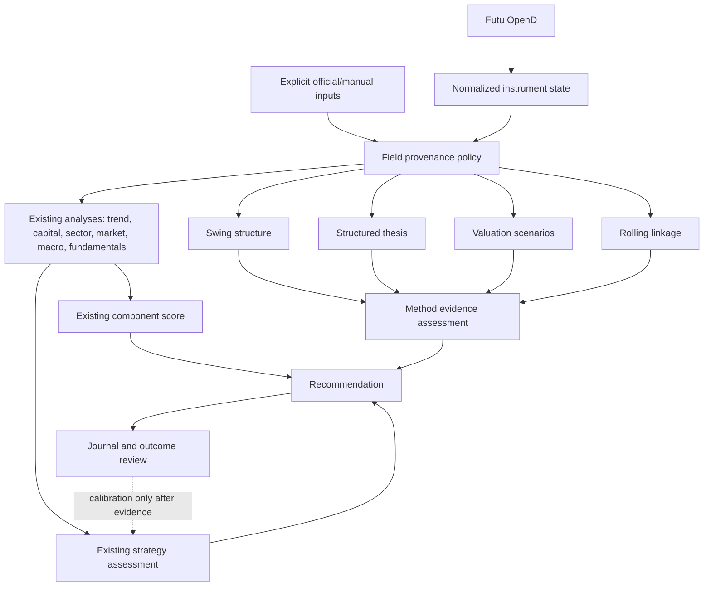

# Finance Methodology Evidence Layer Design

Date: 2026-07-21
Status: Approved design; implementation not started

## 1. Purpose

Borrow the strongest analytical methods from `/Users/shuren/WorkSpace/codes/finance-skills` without replacing the existing `stocks` data path or blindly importing US-market assumptions.

The upgrade adds explainable evidence for:

- earlier recognition of 1–4 week swing setups;
- business and valuation logic before technical confirmation;
- dynamic market, sector, and cross-asset linkage;
- explicit uncertainty, source provenance, and thesis invalidation.

The system continues to cover US, A-share, and Hong Kong instruments. Futu OpenD remains the primary and authoritative data source. The output remains analysis and decision support only; it must not place trades.

## 2. Accepted Boundaries

### 2.1 In scope

1. Add a market-specific profile layer for US, A-share, and Hong Kong analysis conventions.
2. Add four independent analytical modules:
   - swing structure and stage analysis;
   - structured investment thesis;
   - valuation scenarios;
   - rolling linkage and conditional correlation.
3. Attach the new outputs to recommendations as a separate method evidence assessment.
4. Let clearly negative, sufficiently supported evidence restrict new entries or additions.
5. Journal the new evidence so its predictive value can be measured before it receives positive score weight.
6. Preserve the existing ATR/structure-based sizing, partial profit-taking, trailing-stop, and position-state logic.

### 2.2 Out of scope

- No `yfinance` dependency or Yahoo Finance data in this iteration.
- No replacement of OpenD snapshot, K-line, order-book, capital-flow, valuation, or financial data.
- No fixed US Treasury, equity-risk-premium, terminal-growth, valuation-multiple, liquidity, or stop-loss assumptions applied to A-share or Hong Kong instruments.
- No automatic web scraping, TradingView cookies, social-media readers, or paid-data integrations.
- No immediate positive score boost from the new methods before outcome calibration.
- No automatic trading and no change to the unified watchlist membership in this work.
- No forced DCF when required inputs are absent or unreliable.

## 3. Findings Borrowed from `finance-skills`

| Source method | Adopt | Adapt | Reject |
| --- | --- | --- | --- |
| SEPA / trend template | Stage 1–4, MA50/150/200 alignment, rising MA200, pivot, contraction, breakout volume | Market-specific liquidity and limit rules; Stage 1 can support an early probe | US-only thresholds, Stage-2-only entry, fixed 7%–8% stop |
| Company valuation | Bull/Base/Bear cases, method agreement, sensitivity, explicit assumptions | Use only methods supported by available OpenD or manual official inputs | Hard-coded US discount rates, terminal growth, peer sets, and fabricated DCF completeness |
| Stock correlation | 20/60-day rolling correlation, beta, stability, downside correlation | Route each instrument to market, sector, and thematic references | Treating one full-sample Pearson correlation as a causal signal |
| Earnings workflows | Consensus-versus-actual structure, expectation gap, post-event reaction | Defer automated consensus until a reliable source exists; allow explicit manual official inputs | Yahoo-only analyst estimates or unaudited scraped expectations |
| Liquidity analysis | Spread, relative volume, turnover, market-impact awareness | Prefer OpenD ten-level order book and market-specific lot/limit behavior | US liquidity thresholds and Yahoo top-of-book as authoritative data |

## 4. Architectural Position

The new methods form a sidecar evidence layer. They do not replace the existing component score or the authoritative `strategy_assessment`.



The initial release is deliberately asymmetric:

- positive method evidence explains and ranks a setup but adds zero points to `setup_score`;
- a supported negative structure or evaluated thesis invalidation may downgrade the decision;
- missing method evidence remains `unknown`, never a neutral score of 50 and never invented support.

This prevents uncalibrated optimism while allowing earlier, smaller probes instead of waiting for every lagging confirmation.

## 5. Market Profiles

Add one routing unit whose only responsibility is to select analytical conventions from the instrument code and asset type. It does not fetch data.

Initial profiles:

- `us-equity-v1`
- `a-share-equity-v1`
- `hk-equity-v1`
- existing ETF and leveraged overlays remain separate and composable

Each profile defines:

- default market and sector benchmarks;
- trading-session and bar-completeness conventions;
- price-limit, lot-size, and liquidity interpretation where applicable;
- valuation methods allowed for that market and asset type;
- minimum history required by each method;
- market-specific labels and notes.

Profiles must not contain live values. Risk-free rates, peer multiples, growth rates, and event expectations are evidence fields with timestamps, not permanent constants hidden in a profile.

## 6. Source and Provenance Policy

### 6.1 Source order

The current iteration uses:

1. `opend`: primary source for live and historical market data, capital flow, order book, supported valuation, and supported financial data;
2. `official-manual`: explicit values derived from exchange filings, company reports, or user-supplied official facts when OpenD does not expose them;
3. `unknown`: the required value is unavailable.

`yfinance` is not installed, called, or declared as a dependency.

### 6.2 Field-level provenance

Every newly introduced non-derived input carries:

- `value`;
- `source`;
- `as_of`;
- `freshness` (`live`, `current`, `stale`, or `unknown`);
- `confidence` from 0 to 1;
- optional source reference.

Derived values list their input fields and calculation version.

### 6.3 Authority rules

- Live price, bar, order-book, capital-flow, and trigger decisions are OpenD-only.
- Official/manual inputs may supplement company, event, or valuation assumptions but may not replace a newer OpenD market value.
- A material conflict is surfaced as `source_conflict`; it blocks `enter` and `add-on-profit` until resolved.
- Stale or missing data blocks only the method or gate that depends on it unless the existing data-quality policy already treats the field as critical.
- No unavailable field is silently converted to zero, 50, false, or a favourable default.

## 7. New Analytical Modules

Each module is deterministic, has one public input/output contract, and can return `unknown` without breaking the rest of the recommendation.

### 7.1 Swing structure

Purpose: provide a 1–4 week structural view that is earlier and more explicit than the current MA10/20/50 trend summary.

Inputs:

- at least 220 completed daily bars for a complete long-term template;
- volume and turnover from the same bars;
- current price and market profile.

Outputs:

- `stage`: `stage-1`, `stage-2`, `stage-3`, `stage-4`, or `unknown`;
- MA50/150/200 values and slopes;
- trend-template checklist with pass/fail/unknown per condition;
- pivot and buy-zone bounds when objectively detectable;
- contraction count and contraction quality;
- breakout-volume confirmation;
- `gate_effect`: `none`, `probe-only`, or `reject-new-risk`;
- notes, coverage, and confidence.

Initial decision semantics:

- Stage 2 supports normal swing evaluation but does not independently authorize entry.
- Late Stage 1 near a defined pivot may permit only the existing small-probe path when all current risk, liquidity, event, and reward-to-risk gates pass.
- Stage 3 or Stage 4 rejects new swing entry and addition. It does not force liquidation of an existing position; the existing position and exit state machine remains authoritative.
- Fewer than the required bars produces `unknown`, not Stage 1.
- For the short profile, long-term stage is explanatory and cannot veto a valid 1–3 day setup unless a separate existing risk gate fails.

### 7.2 Structured thesis

Purpose: make price drivers and invalidation explicit before technical evidence is interpreted.

Outputs:

- primary upside drivers;
- primary downside drivers;
- Bull/Base/Bear paths;
- catalysts and expected time horizon when explicitly evidenced;
- falsifiable invalidation conditions;
- unresolved questions;
- coverage and confidence;
- thesis state: `supported`, `mixed`, `invalidated`, or `unknown`.

Rules:

- The module may use observed fundamentals, sector behavior, market context, and explicit official/manual facts.
- It must distinguish observation from inference.
- A template sentence is not sufficient evidence.
- Only a machine-evaluated invalidation condition with adequate provenance can set `invalidated` and reject new swing risk.
- Missing catalysts or narrative data yields `unknown` or `mixed`; it must not fabricate a company story.
- Short trades may rely on a price/flow thesis. New swing entries require at least `mixed` thesis coverage and no evaluated invalidation.

### 7.3 Valuation scenarios

Purpose: express valuation as a range of assumptions rather than one PE/PB label.

Outputs:

- available methods: relative valuation, growth-adjusted multiples, asset-based method, SOTP, or DCF;
- Bull/Base/Bear assumption sets;
- per-method value range when inputs are sufficient;
- sensitivity table for the two assumptions that dominate the selected method;
- method disagreement and uncertainty;
- coverage, freshness, and confidence.

Rules:

- Relative valuation may run from OpenD valuation and financial data when an explicit peer or benchmark set is available.
- DCF runs only when cash-flow, balance-sheet, discount-rate, and terminal assumptions are all explicit and sourced. Otherwise its status is `unavailable`.
- Market profiles select allowed methods, not favourable assumptions.
- Valuation cannot trigger a short-profile entry. It can warn about asymmetric downside or reinforce a swing thesis.
- High method disagreement lowers confidence and blocks an `enter`/addition decision only when valuation is a declared critical part of the thesis.

### 7.4 Rolling linkage

Purpose: replace static or intuitive cross-market linkage with measurable, time-varying relationships.

Inputs:

- completed daily bars for the instrument and configured references;
- market, sector, thematic, and optional macro proxies already available through OpenD;
- market profile.

Outputs per reference:

- 20-day and 60-day return correlation;
- rolling beta;
- downside correlation on negative reference-return sessions;
- correlation stability or regime change;
- observation count, coverage, and confidence;
- linkage stance: `confirming`, `diverging`, `unstable`, or `unknown`.

Rules:

- Use aligned completed sessions and returns, not raw prices.
- Do not infer causality from correlation.
- A weak or unstable relation cannot be used as a hard gate.
- A stable, historically meaningful negative linkage may reduce environment confidence, but only alongside an adverse current reference move.
- Intraday capital flow and order book remain instrument-local evidence and are never substituted by daily correlation.

## 8. Recommendation Contract

Add a structured `method_assessment` to `Recommendation` containing:

- market profile identifier;
- swing-structure result;
- thesis result;
- valuation-scenario result;
- linkage result;
- aggregate coverage and confidence;
- `restrictions` applied to entry or position actions;
- source conflicts;
- method-policy version.

The legacy component score remains available for historical comparison. `strategy_assessment` remains the authoritative execution verdict.

The initial policy is:

```text
if existing hard gate fails:
    preserve existing reject/watch behavior
elif supported thesis invalidation:
    reject new swing entry or addition
elif swing Stage 3 or Stage 4:
    reject new swing entry or addition
elif late Stage 1 near pivot and existing probe gates pass:
    allow probe-only
else:
    do not change the current decision
```

The method layer does not alter current strategy thresholds: full entry requires a setup score of at least 65, a supporting evidence cluster qualifies at 60 or above, and the current profile-specific probe thresholds remain 58 for short and 62 for swing. The method layer cannot turn a score below the applicable strategy threshold into an action, and positive method evidence initially adds no score.

Any change to gate behavior requires a new `DECISION_POLICY` value. Any serialized contract change requires a new `SCHEMA_VERSION`; historical journal readers continue to accept older versions.

## 9. Avoiding Late Decisions

The design separates early participation from full confirmation:

1. `probe-only`: late Stage 1, an objective pivot, improving demand, and all current swing-probe gates permit only the existing risk-sized, profile-capped probe allocation.
2. `normal evaluation`: confirmed Stage 2 and current strategy gates permit the ordinary calculated allocation.
3. `reject-new-risk`: Stage 3/4, evaluated thesis invalidation, data conflict, or an existing hard-gate failure.

This does not lower any current strategy threshold or chase an already extended breakout. It gives the existing swing-probe path better structural evidence before full confirmation while preserving structural invalidation and portfolio heat limits.

## 10. Data Flow and Failure Handling

1. Fetch OpenD data through the current fetcher and normalize it into existing snapshots and bars.
2. Select a market profile from code and asset type.
3. Create provenance records for new external or explicit inputs.
4. Run existing analyses unchanged.
5. Run the four new method modules independently.
6. Aggregate only their restrictions, conflicts, coverage, and explanatory evidence.
7. Apply restrictions after the current setup score and existing hard gates are calculated.
8. Serialize the recommendation and journal all new evidence.

Failure behavior:

- One method exception becomes an `unknown` result with an error note; other analyses continue.
- An OpenD live-data failure follows the existing data-quality gate and cannot be bypassed by manual data.
- Misaligned or insufficient histories make linkage or stage `unknown`.
- Invalid valuation assumptions reject that valuation method, not the entire recommendation.
- Serialization must preserve explicit `null`/`unknown` states.
- CLI output must identify which restriction changed a decision and must never imply that unavailable evidence passed.

## 11. Rollout and Calibration

### Phase 1: shadow evidence

- Produce and journal all four method outputs.
- Apply only the approved negative restrictions and probe-only semantics.
- Do not add positive score weight.

### Phase 2: outcome review

- Compare method states with 1-, 3-, 5-, 10-, and 20-session outcomes.
- Measure MFE, MAE, stop/target path, false-breakout rate, and decision usefulness by market and strategy profile.
- Track whether each negative restriction avoided losses and whether probe-only entries improved expectancy or merely increased noise.

### Phase 3: calibrated promotion

- Promote a method into positive score weight only after sufficient out-of-sample evidence by market and horizon.
- Any promoted weights, thresholds, or gates require a documented policy version bump and regression comparison against the frozen baseline.
- No self-modifying live weights without an explainable, reversible review artifact.

## 12. Test Strategy

### Unit tests

- Market routing for US, A-share, Hong Kong, equity, ETF, and leveraged overlays.
- Stage classification, insufficient-history behavior, MA slopes, pivot detection, contraction count, and breakout-volume confirmation.
- Thesis observation/inference separation, invalidation evaluation, and unknown behavior.
- Valuation method eligibility, incomplete DCF rejection, scenario ordering, sensitivity, and method disagreement.
- Return alignment, 20/60-day correlation, beta, downside correlation, and unstable-regime detection.
- Provenance precedence, freshness, conflict detection, and explicit unknowns.
- Restriction precedence and the invariant that positive method evidence adds no score in Phase 1.

### Integration tests

- OpenD-backed normalized data enters the new modules without an alternate market-data fetch.
- A valid late-Stage-1 setup can become `probe-only` only after current probe gates pass.
- Stage 3/4 and supported thesis invalidation restrict new swing risk without forcing an existing-position exit.
- A method failure leaves the current recommendation available with reduced method coverage.
- Recommendation JSON and journal records round-trip across old and new schema versions.
- US, A-share, and Hong Kong fixtures retain their own profiles and do not inherit another market's assumptions.

### Regression tests

- Existing component scores do not change solely because the method layer is present.
- Existing structured exits, position sizing, leveraged overlay, heat gates, event gates, and watchlist scans remain unchanged.
- No `yfinance`, Yahoo endpoint, order placement, or new network dependency is invoked.
- The full existing test suite passes before and after the schema/policy version change.

## 13. Acceptance Criteria

1. The four method modules return deterministic structured output with coverage and confidence.
2. OpenD remains the source of all live trigger evidence.
3. US, A-share, and Hong Kong analysis uses explicit, separate profiles.
4. Missing method data is `unknown`, never neutral or favourable by default.
5. Positive method evidence does not increase Phase-1 setup scores.
6. Supported Stage 3/4 or thesis invalidation blocks new swing risk but does not issue an automatic sell.
7. A qualified late-Stage-1 setup can use the existing risk-sized, profile-capped swing-probe path without lowering its current 62-point threshold.
8. Valuation output exposes assumptions and refuses unsupported DCF.
9. Rolling linkage uses aligned returns and reports instability rather than implying causality.
10. Existing risk management, watchlist behavior, and no-trade boundary remain intact.

## 14. Implementation Decomposition

The implementation plan should order work as follows:

1. provenance and market-profile contracts;
2. swing-structure module;
3. rolling-linkage module;
4. structured-thesis and valuation-scenario modules;
5. recommendation aggregation, gate policy, and versioning;
6. CLI, journal, documentation, and full regression verification.

Each step must follow test-driven development. The implementation must not add a fallback data library unless a later design is separately approved.
